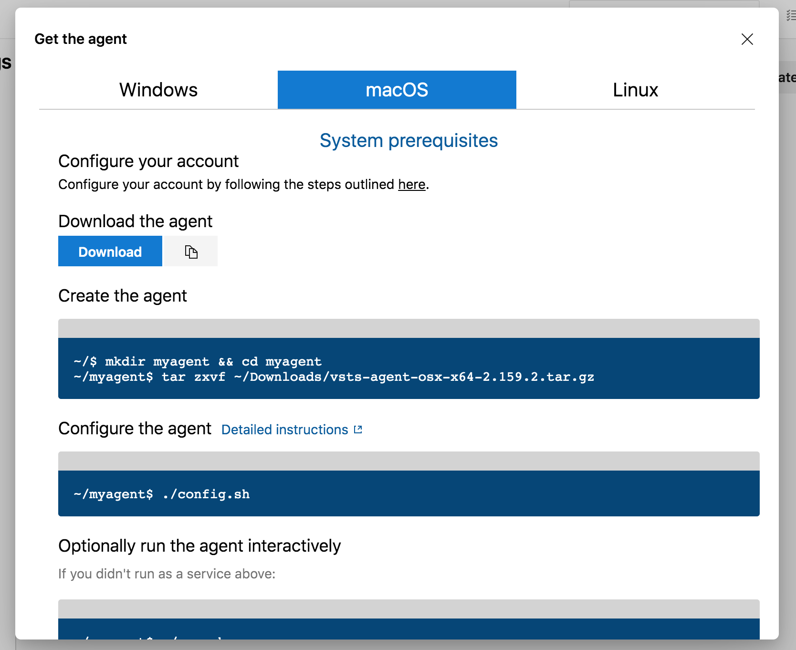
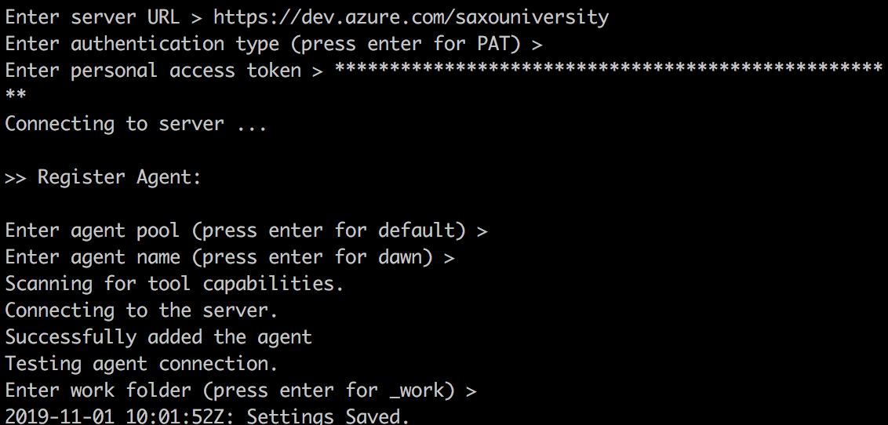
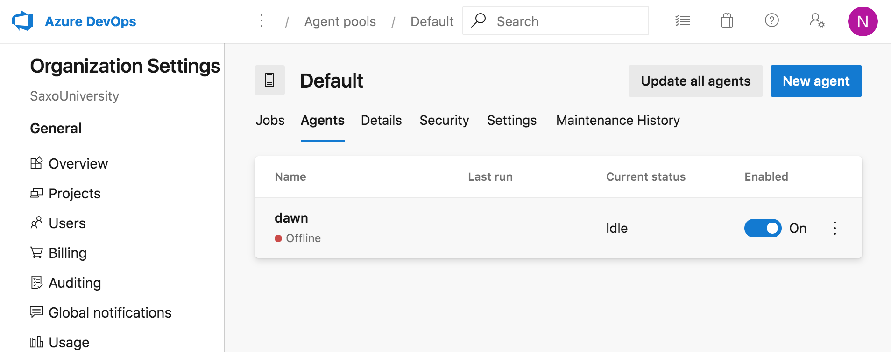
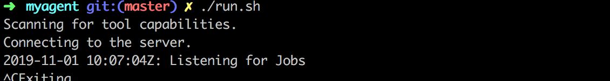
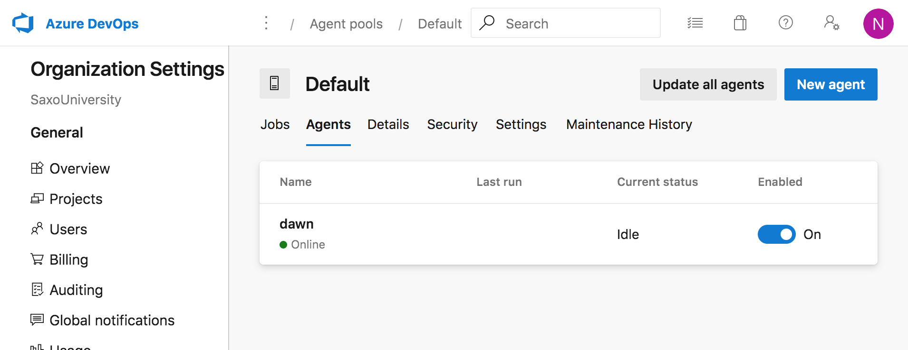
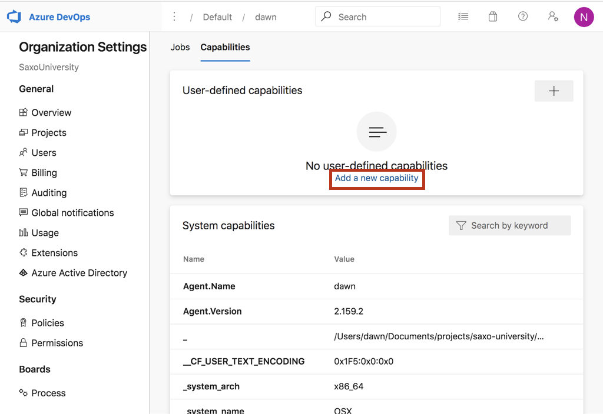

Refer : https://docs.microsoft.com/en-us/azure/devops/pipelines/agents/v2-osx?view=azure-devops (Self-hosted macOS agents

Permissions : **agent pool administrator**  permissions is requried to register an agent to the pool

### Downloading agent on Macos

- got to **organization setting**
- go to **AgentPools** (under pipelines)
- Choose **Default** agent pool
- Got to agents tab
- click on **"New Agent"**
- Download installable agent software for macOS

### Createing  PAT (personal access token )

- to be able to manage agent pools on azure devosp server from local machine
- go to user profile and create new token
- assign permissiong **Agent Pools (read, manage)** (or use full access)
- copy the PAT and save somewhere safe

### Setup agent on Macos

- unzip downloaded tar
- run `./config.sh`
- enter the server url or organization as https://dev.azure.com/<org-name> (e.g `https://dev.azure.com/saxouniversity`)
- enter PAT as copied from previous step

- Now view the agent in default agent pool : 

  

- Now run `./run.sh` to start the agent locally

  

- now view the agent in defualt agent pool (online now)

  

- Open agents and got to capabilites tab to view capablities (OS, env variables)
- Also we can add capability (nam-value pair) as a new user defined capability

- 